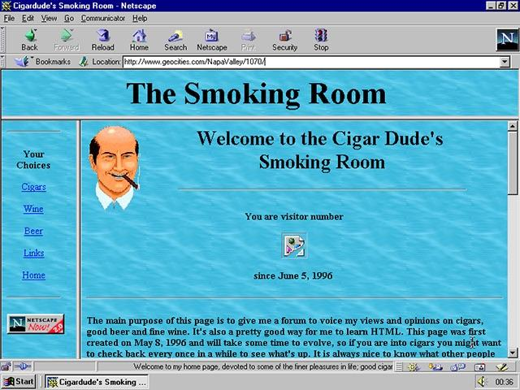

# Node, Part 3: Persistence

## Authors
Sam Tarakajian for NYU

@starakaj

## Essential Questions
- How can we persist data over a long period of time, even if the server restarts?
- How can we create user accounts?
- What is CRUD? How can we implement it?

## Introduction
We've seen how to put a Node server on the Internet. The question is, how does that server store data? It could store data in memory, but then that goes away when the server closes. It could write files to disk, but file access is slow, especially if multiple people are trying to read/write a file at the same time.

### Target Audience / Prerequisite & Pre-Assessment
The first two Node classes are prerequisite for this class.

### Outcomes & Goals
* In this workshop we will be looking at how to implement data persistance on a web server. We will store data on a server, and update that data using an API call.
* Students will walk away with an understanding of how web servers work. They will understand how to implement a basic CRUD—Create, Read, Update, Delete—data store.

### Pacing / Duration
This workshop is indended to last about three hours

- Class breakdown
  - :15 Discussion of last week's reading
  - :10 Starting from a repo with some basic parts (express)
  - :10 Implementing a counter using just JSON
  - :15 Upgrading to a real database

## Materials Needed
- You should have the following installed on your machine:
    - nvm
    - git
    - mongodb
        - See https://docs.mongodb.com/manual/administration/install-community/ for platform-specific installation instructions
    - sign up for heroku
    - (recommended) mongodb compass https://www.mongodb.com/download-center/compass which you can use to visualze your database

### Exercises To Do Before Class
- Introduce yourself to MongoDB concepts
    - https://docs.mongodb.com/manual/introduction/
    - https://docs.mongodb.com/manual/core/databases-and-collections/
    - https://docs.mongodb.com/manual/core/document/
    - https://docs.mongodb.com/manual/crud/
- Sign up for Heroku. Seriously, do it.

### Vocabulary (example)
* Database
* Deploy
* Virtual Machine

## Exercise Descriptions

### Visit counter

Way back in the day, back when the internet was cool, you would go to someone's home page and it would look like this:

Beautiful. See, these sites used to have a visitor counter, that would count the number of times someone had visited the page. Let's try to implement something like that, and we'll see that it's not as easy as it seems.

First, copy over the express template from the link I've provided.

## Student Reflections, Takeaways & Next Steps
Additional materials for the students to leave with that can help them dig deeper into the subject or additional exercises and challenges to help students progress their knowledge to the next level and gain mastery of the subject through independent study.

* Multiple Project Exit Points: an idea of high-medium-low projects so students are locked into one end product.
  * First Steps - a simple exercise
  * Next Steps - medium exercise
  * Big Steps - a challenge or open ended study
* Presentation: how might students share their work? With peers, outside world? What media or platforms could/should be referenced to students to encourage sharing (Instagram, Tumblr...)? 
* Reflection: reflection questions that ask students to think about CS concepts and practices. How can students express what they’ve learned in some creative way?

## Post Session

### References
Include any sources cited, but not directly linked in the unit.

### Implementation Guidance & Teaching Reflection  
e.g. Please provide some guidance based on experience delivering the unit and potential modifications might you are considering making for future iterations of this unit. This is an opportunity for you as the unit author to give teachers practical guidance.

***With thanks and acknowledgement, this is based on the template provided by [Eyebeam](https://github.com/eyebeam/curriculum/blob/master/TEMPLATE.md)***